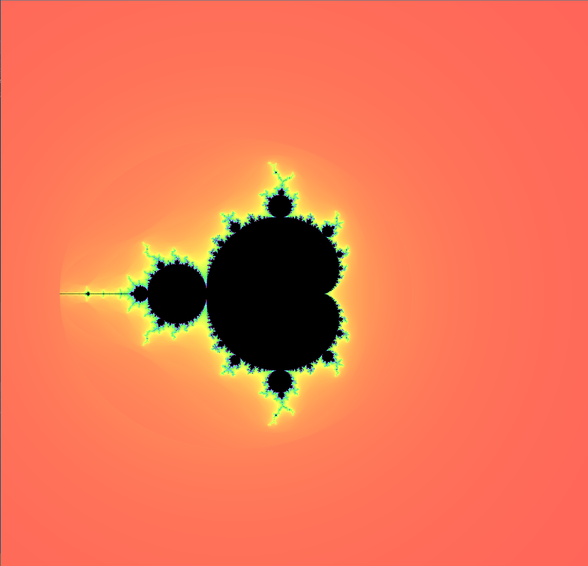
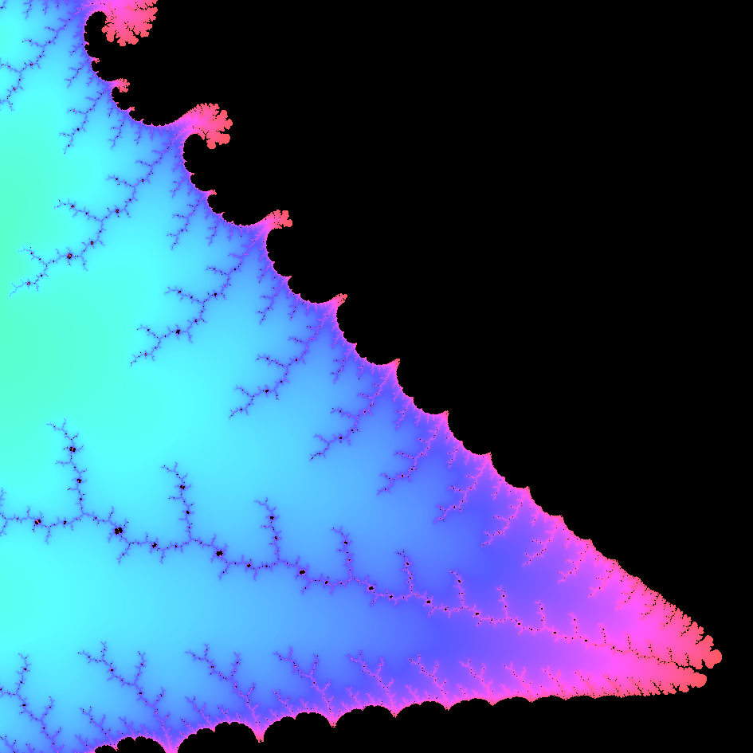
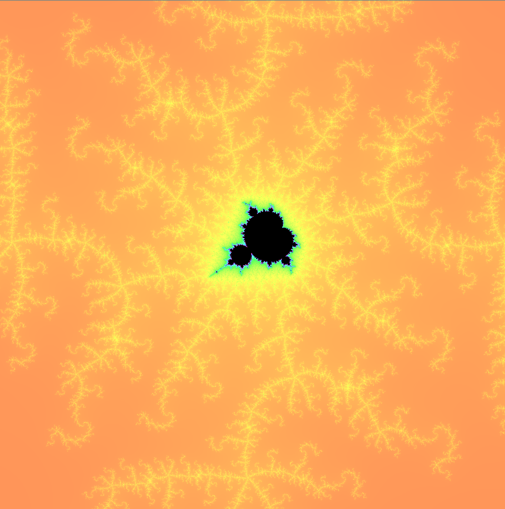
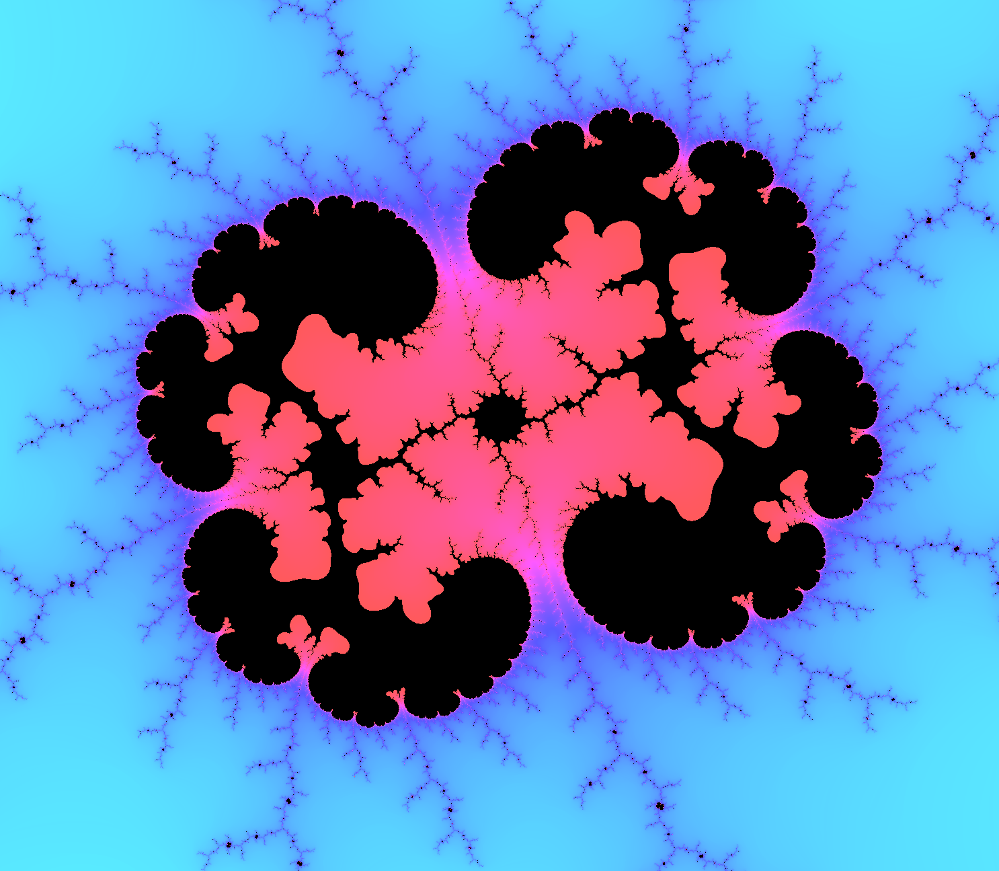

# Generic Mandelbrot Viewer

This project is a CUDA/C implementation of a Mandelbrot Set viewer. If you're not familiar with the Mandelbrot Set: it's staggeringly beautiful (just look at the [samples](#samples)). A passion project. 

# Background info

I've had a fascination for the Mandelbrot Set for a while now - which is why I created the [pybrot project](https://github.com/teunvw14/pybrot) using Python during my 2018 High School summer break; I learned a bunch and really enjoyed the process. 

Unfortunately, because it was written in Python, it was horrendously slow. For that reason, I've wanted to implement a mandelbrot viewer/renderer in a different, faster language ever since I finished that project. 

Obviously, many others have made far better implementations of fractal viewers than this one - but that isn't the point. I wanted to see how much faster *I* could make make it. 

Hence why I created this project: a Mandelbrot viewer that is roughly **five hundred times faster** than my pybrot implementation, thanks to the power of GPU computing and C. Whoo! 

This project taught me:
- the basics of GPU computing using CUDA; and
- how to actually use the fantastic C programming language; and
- most importantly: how pointers work.

# Samples

> The classic Mandelbrot Set image.

> The crest between two of the Mandelbrot's "Bulbs".

> Don't stare at this one too long. 

> One of the Manelbrot's many mini-children.

> Kidneys or something.

# Features

- Basic controls for viewing the mandelbrot set
- Speedy performance thanks to NVIDIA GPU acceleration. Also works on systems without an NVIDIA GPU. 
- Performance test to check performance of (future) optimisations.

# Controls

- Pan image: arrow keys (up, down, right, left)
- Zoom in/out: `+` and `-` keys respectively
- Increase maximum iterations: `[`
- Do a performance test and print results to console: `e` key
- Quit: `esc`

# Build

### Requirements
To build this projects: the following software is required. 
- Visual Studio 19
- The [CUDA Toolkit](developer.NVIDIA.com/cuda-downloads)

### Build using Visual Studio 19
Open the solution in Visual Studio, and build. (`Build > Build Solution`)